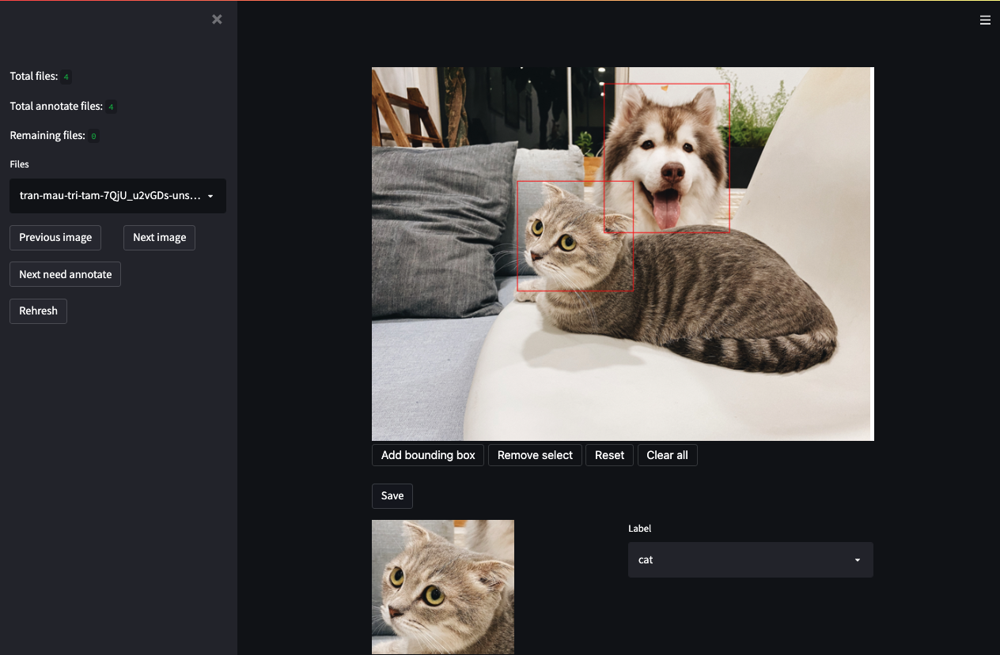

# Streamlit Image Labelling - Blog post

streamlit-img-label is a graphical image annotation tool using streamlit. Annotations are saved as XML files in PASCAL VOC format.

## Installation

In your python virtual environment, run:

```sh
pip install streamlit-img-label
```

## Example
```sh
python app.py
```

## Demo

